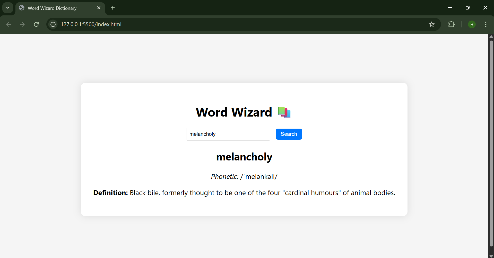

# Word Wizard – Dictionary Web App 📚

A simple dictionary app built using HTML, CSS, and JavaScript. Users can search for any English word and get real-time definitions using the Free Dictionary API.

### 🚀 Features
- Live search from dictionaryapi.dev
- Clean and responsive UI
- Error handling for unknown words

### 🌐 Demo
[Live App](https://yourusername.github.io/dictionary-app)

### 📁 Tech Stack
- HTML
- CSS
- JavaScript (Fetch API)

### 🔗 API Used
https://dictionaryapi.dev/

### 📸 Screenshot

